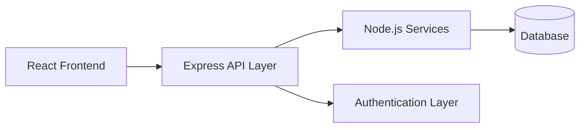

<div align="center">

# ✦ VALANTIR ✦

### **Illuminate Complexity. Unlock Intelligence.**


<br/>

*A modern intelligence platform engineered for clarity, foresight, and data-driven decisions.*

</div>

---

## ✨ Overview

Valantir is a **premium full-stack analytics platform** designed to transform scattered data into meaningful intelligence.

Inspired by the concept of legendary *seeing stones* that reveal hidden truths, Valantir empowers teams with:

- Deep visibility into operational metrics  
- Real-time analytical insights  
- Secure infrastructure for scalable systems  
- A sleek interface for decision-making workflows  

---

## 🏗 Architecture



---

## 🚀 Core Features

<table>
<tr>
<td width="50%">

### 📊 Real-Time Data Visualization
Interactive dashboards  
Live metrics tracking  
Custom chart integrations  

</td>
<td width="50%">

### 🔐 Secure API Architecture
Authentication system  
Protected routes  
Scalable backend services  

</td>
</tr>

<tr>
<td width="50%">

### ⚡ High Performance
Optimized frontend rendering  
Fast API responses  

</td>
<td width="50%">

### 🎯 Actionable Intelligence
Turn raw datasets into strategic decisions  

</td>
</tr>
</table>

---

# 🛠 Tech Stack

<div align="center">

| Frontend | Backend | Styling |
|----------|-----------|----------|
| React | Node.js | Tailwind CSS |
| JavaScript | Express.js | CSS |

</div>

---

# 📁 Project Structure

```bash
valantir/
├── client/
│   ├── src/
│   ├── public/
│   └── package.json
│
├── server/
│   ├── routes/
│   ├── controllers/
│   ├── middleware/
│   ├── models/
│   └── package.json
│
└── README.md
```

---

# ⚙️ Getting Started

## Clone Repository

```bash
git clone https://github.com/yourusername/valantir.git
cd valantir
```

---

## Frontend Setup

```bash
cd client
npm install
npm start
```

🌐 Runs on: `http://localhost:3000`

---

## Backend Setup

```bash
cd server
npm install
npm start
```

🌐 Runs on: `http://localhost:5000`

---

# 🔑 Environment Variables

Create `.env` inside `/server`

```env
PORT=5000
DB_URI=your_database_url
JWT_SECRET=your_secret_key
```

---

# 📈 Future Vision

- AI-powered forecasting  
- Advanced dashboards  
- Multi-user collaboration  
- WebSocket live analytics  
- Enterprise integrations  

---

<div align="center">

## ⚡ Valantir

**See Beyond Data. Build With Precision.**

</div>
